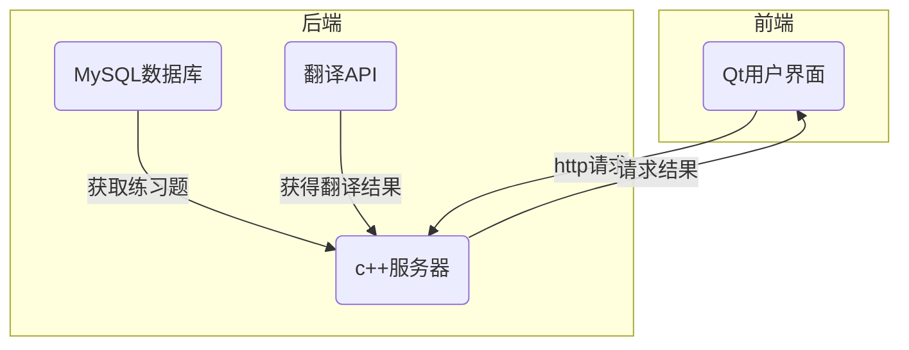
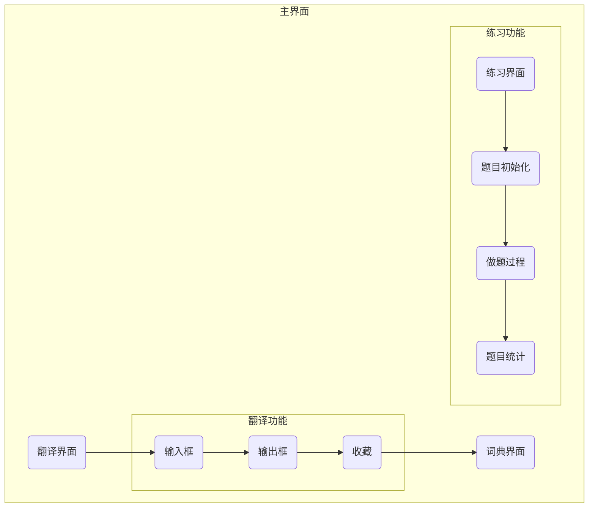
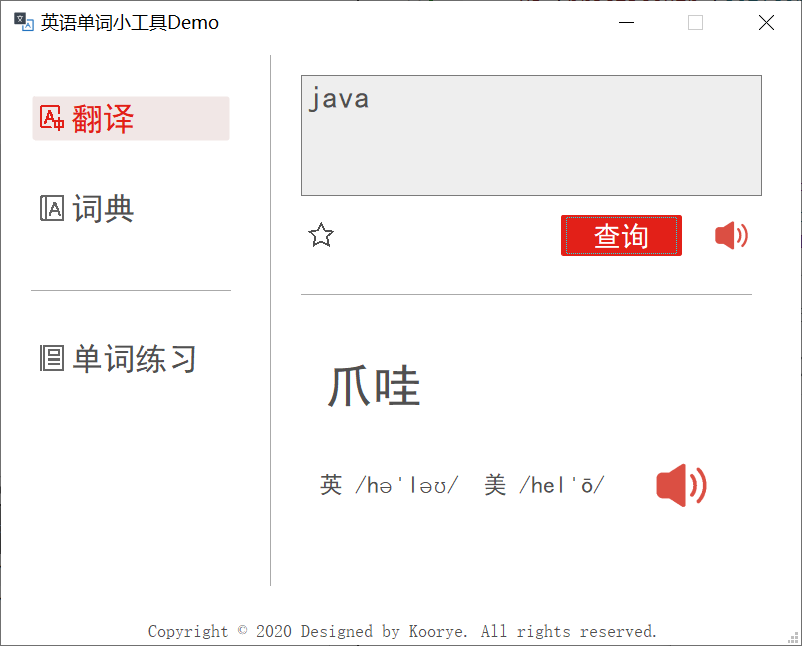
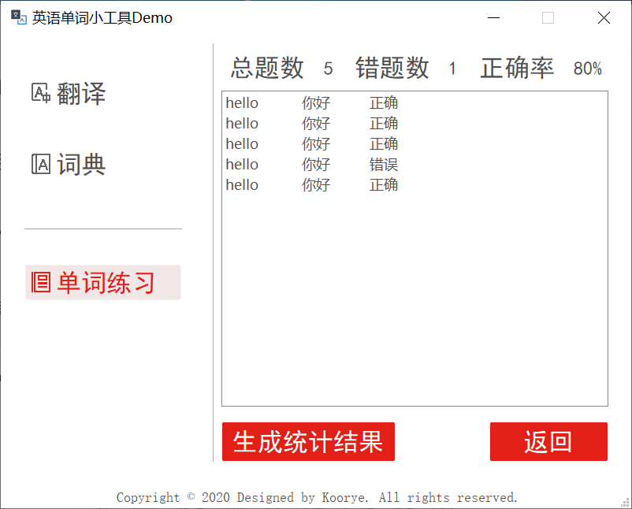

# 一、软件需求说明书

## 1 引言

### 1.1 介绍

本项目名为“英语单词小工具”，它集单词查询、翻译和题目练习于一体，填补了pc端“查英语+练英语”软件的空缺。

本软件除了以上功能之外，还提供了诸如收藏笔记本、语音朗读、错题记录等功能，有着较人性化的设计。

本项目采用前后端分离的形式开发，前端采用Qt实现图形界面和交互；后端采用C++，搭配Python爬虫和MySQL数据库实现翻译和题库功能。

### 1.2 背景

现在市面上已经有很多为学生提供英语学习服务的软件，然而大多数软件都只适用于手机端，pc端只存在一些翻译软件，尚缺集查英语、学英语一体的软件。

### 1.3 设计概念图

## 2 任务概述

### 2.1 目标

本软件旨在提供英语学习，提供一个集英语查询、英语练习于一体，外加一些辅助功能的平台。

### 2.2 用户的特点

在校大学生，中小学生，有英语学习需求的人员。

## 3 运行环境规定

本软件支持Windows、Linux、macOS、Android、IOS、UWP等主流系统。

## 4 用户功能需求

1. 单词查询系统。本系统通过调用API获取用户输入内容的翻译结果，支持中英文互译，并通过调用系统内部的TTS语音引擎实现语音朗读功能。
2. 英语练习系统。本系统通过随机抽取MySQL中的题库，为用户生成一系列选择题。用户可自定义题目数量、难度，并在答题完成后生成统计信息，结果可保存为txt以便后期复习使用。
3. 笔记本系统。本系统可以记录下用户的重点词及其中文翻译，在翻译界面，用户可通过“收藏”按钮将单词记入笔记本中以便查看。笔记本以JSON的形式存于本地，用户随时可以通过软件提供的可视化界面方便的删除不想要的词汇。

## 5 界面操作需求

本软件有相对完善的人机关系设计，用户只需通过键鼠的交互就可以使用软件的完整功能。

# 二、可行性研究报告

## 1 编写目的

编写可行性研究报告的目的是进行该软件系统设计的可行性分析，从经济、技术、法律等方面分析所给出的解决方案是否可行，能否在规定的资源和时间的约束下完成。

## 2 技术可行性

1. 本软件基于Qt搭建，Qt拥有优秀的跨平台性能，一套代码通过一键部署，就可以支持绝大多数主流平台。因此本软件在跨平台服务上无技术问题。

2. 本软件的设计封装良好，充分考虑用户操作的各种可能性，排查了用户在输入和点击过程中可能出现的问题。因此本软件在日常使用过程中无技术问题。

3. 本软件后台服务器设计安全，TODO...

## 3 经济可行性

软件将以开源的形式发布，通过捐助的方式获取收益。基于LGPL协议，软件在开发过程中不存在成本问题，不需要为Qt官方付费。因此经济方面不存在问题。

## 4 社会因素方面的可行性

1. 本软件基于LGPL协议，以开源形式发布，不存在商业、专利、版权纠纷等问题。
2. 本软件不会收集用户的个人信息，不会侵犯用户的个人隐私，不收集非法信息，符合法律规定。

## 5 结论

本项目通过以上所有可行性分析，可以实行。

# 三、系统设计说明书

## 1 面向对象设计

### 1.1 系统设计

## 2 面向对象建模

### 2.1 用况建模

### 2.2 静态建模

### 2.3 动态建模

# 四、界面设计说明书

## 1 人机界面设计模型

## 2 基于用户群体的因素

本软件旨在服务大学生、中小学生和有英语学习需求的人员，因此界面设计须简单清晰。

## 3 任务分析

本项目属于教辅类软件项目，软件的功能应围绕用户的学习展开，旨在让学习更高效、更简便、更轻松。因此，本软件不仅需要实现翻译和练习题的功能，还需要设计提高学习效率和便于人机交互的各种细节和辅助功能。

## 4 用户界面风格

本产品的界面在原生UI基础上，自行编写样式表、绘制UI图标，设计风格简洁、功能清晰、排版合理，具有良好的人机关系。采用图标和文字相结合的方式，用最少的文字量为用户提供最多的信息，界面不仅美观，而且便于理解和上手。

## 5 遵守黄金三原则

### 5.1 让用户拥有控制权

1. 用户在任何界面都可以自由切换，灵活控制。
2. 软件提供各种自由可编辑控件与自定义选项，方便用户操作。

### 5.2 减少用户的记忆负担

1. 软件设计各种友好提示，如文本框内的输入提示。
2. 软件提供将用户内容保存到本地磁盘的渠道，下次用户使用时会自动读取。如词典界面实现了完整的JSON读写和解析功能，用户的单词列表以JSON格式存入本地，每次软件打开时会自动读取写入列表中。

### 5.3 保持界面一致

所有界面采用相同的红白配色风格，设计样式、字体等内容保持一致。界面分层合理，由三个界面组成一级页面，这些界面的子界面组成二级界面。

## 6 具体界面

### 6.1 主界面

主界面为翻译界面，用户可输入想要查询的内容到输入框中，点击查询，即可获取翻译结果。支持中英文互译和语音播报。用户可以点击收藏（星星按钮），将重点词存入词典中。

### 6.2 副界面

副界面分为词典界面和单词练习界面，词典界面中会存放用户收藏的内容，用户随时可以删除不想要的内容。

用户可以在单词练习开始界面自定义题目的难度和数量，不同难度会匹配不同的题库。

### 6.3 练习界面的子页面

下图为用户做题过程中的界面。

下图为用户做完所有题之后的界面，界面将统计用户本次练习的概览信息和每道题目的英文单词、中文翻译和正误。用户可以通过“生成统计结果”按钮，将统计信息以文本形式保存到本地。

## 7 总结

本软件的界面设计符合人机关系，分页合理、内容简洁、功能明显、交互性好、美观实用，达到了预期要求。

# 五、数据库设计说明书

## 1. 引言

### 1.1 编写目的

### 1.2 背景

### 1.3 定义

### 1.4 参考资料

## 2 外部设计

## 3 结构设计

### 3.1 概念结构设计

### 3.2 逻辑结构设计

### 3.2.1 数据库表

## 3.3 物理结构设计

## 4 运用设计

# 六、测试计划

# 七、软件项目管理

# 八、操作手册

# 九、用户手册

# 十、致谢

